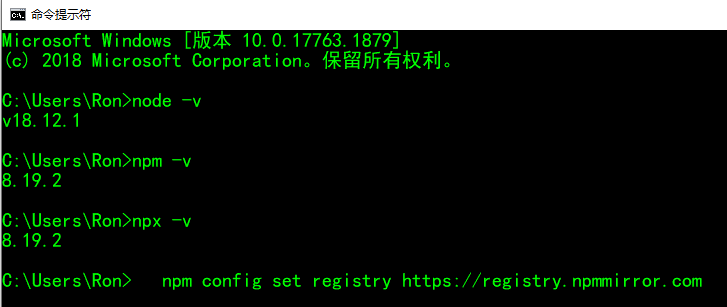
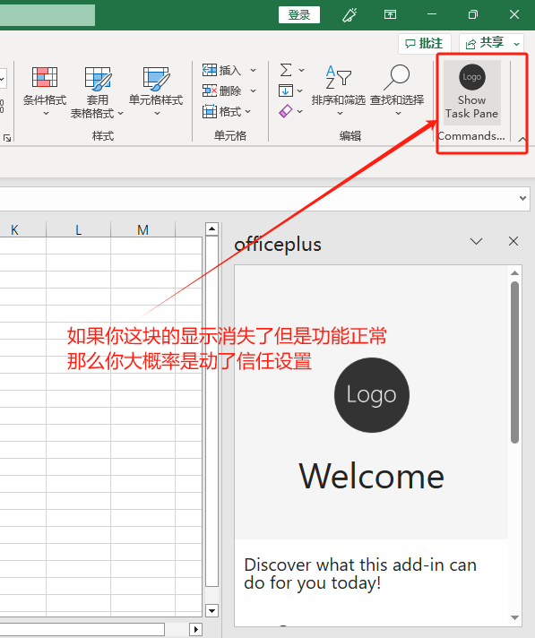
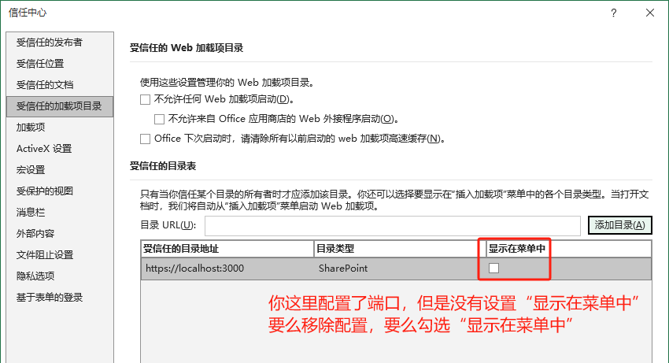

# Yeoman

## 环境搭建

安装nodejs：https://nodejs.org/zh-cn，安装完成后执行以下4步

```js
// 检查node环境
node -v
// 检查npm环境
npm -v
// 检查npx环境
npx -v
// 配置淘宝源
npm config set registry https://registry.npmmirror.com
```




## 安装yo脚手架

```javascript
npm install -g yo generator-office
```

## 创建office项目

```
yo office
```

选择reacrt+ts+excel

取个名字，例如：office-first

等待5分钟，根据电脑性能进行等待（如果npm版本过低会报错）


## 运行

项目创建完成后，执行`cd office-first`，并执行`npm start`

这里会启动2个窗口，一个是webpack的server，另外一个是拉起excel加载插件的程序，并加载edge浏览器的窗口。

然后回提示你是否要安装证书，默认点击是

另外`Allow localhost loopback for Microsoft Edge WebView? `你需要输入Y

webpack-server默认占用3000端口，启动起来后，你可以在浏览器访问https://localhost:3000/taskpane.html查看页面是否正常。

需要注意的是这里是https，因为excel只能调用https协议的服务，前面交互有提示安装https证书，所以这里可以访问到。


## 创建项目遇到的问题

### 无法访问github

如果download github office.zip报错，说明你现在访问不到github，配置方式如下：

异常信息：Unable to download project zip file for "https://github.com/OfficeDev/Office-Addin-TaskPane-React/archive/yo-office.zip".
Error: read ECONNRESET

2种方式配置访问github

1. 点击下载最新的github hosts <https://raw.hellogithub.com/hosts> 

   把内容复制到`C:\Windows\System32\drivers\etc\hosts`中，保存

2. 通过站长之家ping测速https://ping.chinaz.com/github.com

   找到最快的ip维护到hosts，我这里是20.205.243.166

注意hosts使用文本编辑器打开，打开前需要保证当前用户有可写入的权限

然后重新执行创建office项目

### Excel版本注意事项

注意：excel 2015之前的版本无法正确加载，需要安装新版本并激活，我试过excel 2016及其之后的可以

旧版本报错如下：


激活推荐ohook和kms，[ohook激活方式如下](https://www.cnblogs.com/fanqisoft/p/18503682)

### 打开的是WPS应用

如果你这里拉起的是WPS，则需要修改一下xlsx的默认加载程序（操作如下）


### npm版本过低

重装node、npm即可


### 开始菜单栏不显示插件



文件->选项->信任中心->信任中心设置->受信任的加载目录




## 项目解析

### 项目组成

- 项目的根目录中的 **./manifest.xml** 或 **manifest.json** 文件定义加载项的设置和功能。
- **./src/taskpane/taskpane.html** 文件定义任务窗格的 HTML 框架，而 **./src/taskpane/components** 文件夹内的文件定义任务窗格 UI 的各个部分。
- **./src/taskpane/taskpane.css** 文件包含应用于任务窗格中的内容的 CSS。
- **./src/taskpane/components/App.tsx** 文件包含用于加快任务窗格与 Excel 之间的交互的 Office JavaScript API 代码。

### package.json解析


