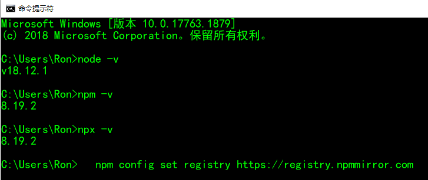
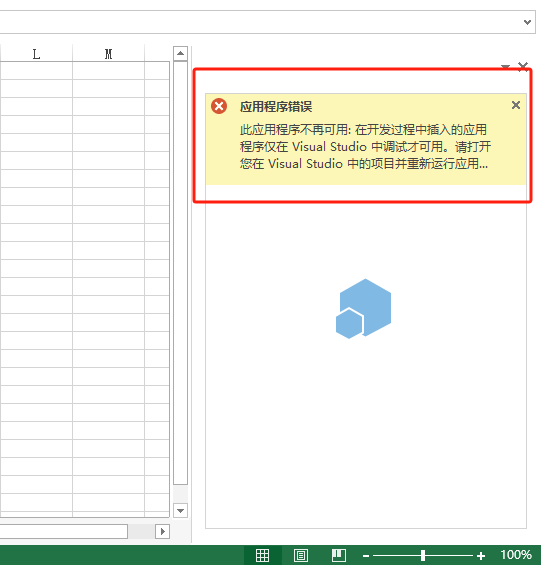
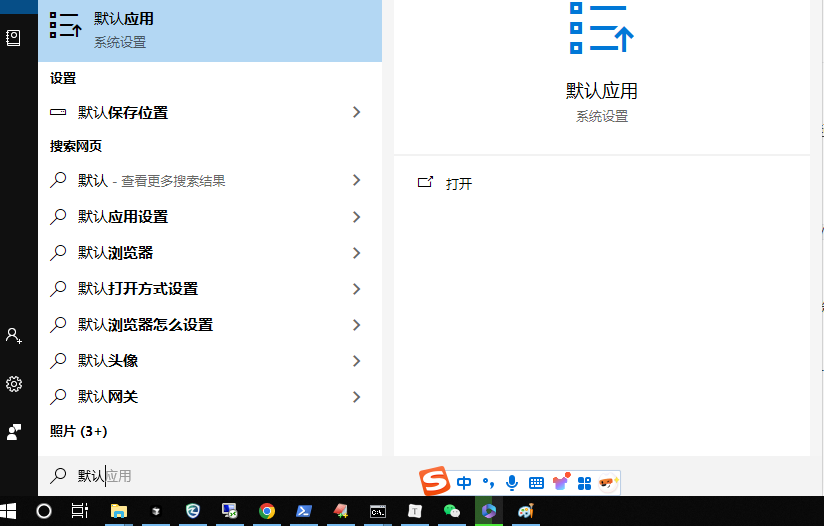
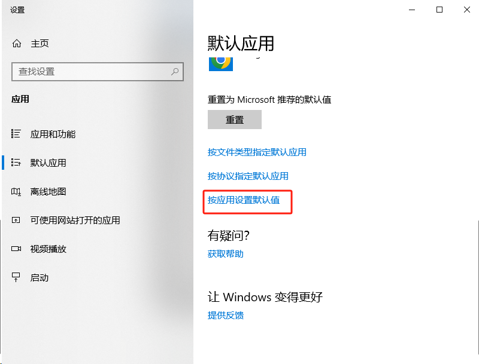
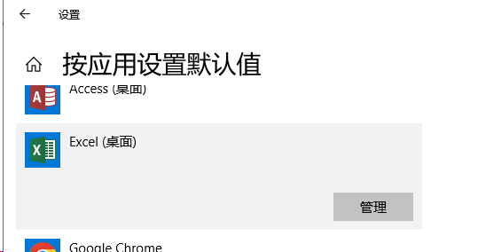
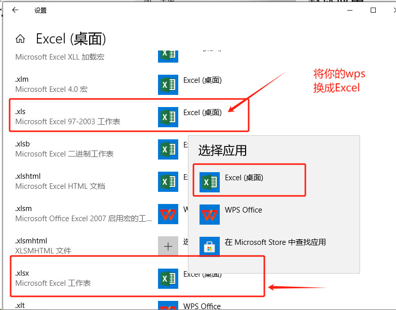
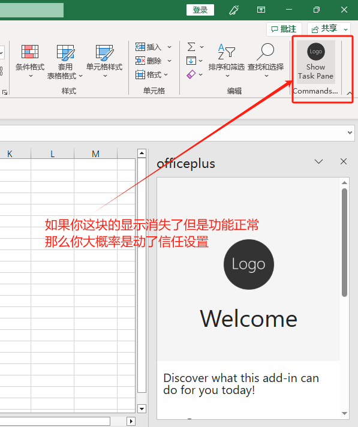
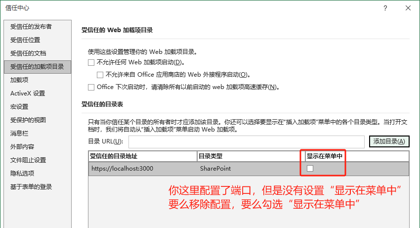

# 一、Yeoman创建项目

官方文档：https://learn.microsoft.com/en-us/office/dev/add-ins/tutorials/excel-tutorial?tabs=jsonmanifest


## 环境搭建

安装nodejs：https://nodejs.org/zh-cn，安装完成后执行以下4步

```js
// 检查node环境
node -v
// 检查npm环境
npm -v
// 检查npx环境
npx -v
// 配置淘宝源
npm config set registry https://registry.npmmirror.com
```




## 安装yo脚手架

```bash
npm install -g yo generator-office
```

## 创建office项目

```bash
yo office
```

选择reacrt+ts+excel

取个名字，例如：office-first

等待5分钟，根据电脑性能进行等待（如果npm版本过低会报错）


## 运行

项目创建完成后，执行`cd office-first`，并执行`npm start`

这里会启动2个窗口，一个是webpack的server，另外一个是拉起excel加载插件的程序，并加载edge浏览器的窗口。

然后回提示你是否要安装证书，默认点击是

另外`Allow localhost loopback for Microsoft Edge WebView? `你需要输入Y

webpack-server默认占用3000端口，启动起来后，你可以在浏览器访问https://localhost:3000/taskpane.html查看页面是否正常。

需要注意的是这里是https，因为excel只能调用https协议的服务，前面交互有提示安装https证书，所以这里可以访问到。


## 创建项目遇到的问题

### 无法访问github

如果download github office.zip报错，说明你现在访问不到github，配置方式如下：

异常信息：Unable to download project zip file for "https://github.com/OfficeDev/Office-Addin-TaskPane-React/archive/yo-office.zip".
Error: read ECONNRESET

2种方式配置访问github

1. 点击下载最新的github hosts <https://raw.hellogithub.com/hosts> 

   把内容复制到`C:\Windows\System32\drivers\etc\hosts`中，保存

2. 通过站长之家ping测速https://ping.chinaz.com/github.com

   找到最快的ip维护到hosts，我这里是20.205.243.166

注意hosts使用文本编辑器打开，打开前需要保证当前用户有可写入的权限

然后重新执行创建office项目

### Excel版本注意事项

注意：excel 2015之前的版本无法正确加载，需要安装新版本并激活，我试过excel 2016及其之后的可以

旧版本报错如下：



激活推荐ohook和kms，[ohook激活方式如下](https://www.cnblogs.com/fanqisoft/p/18503682)

### 打开的是WPS应用

如果你这里拉起的是WPS，则需要修改一下xlsx的默认加载程序（操作如下）










### npm版本过低

重装node、npm即可


### 开始菜单栏不显示插件



文件->选项->信任中心->信任中心设置->受信任的加载目录




# 二、项目解析

项目初始化后结构如下

```
officeso
├─ 📁assets
├─ 📁dist
├─ 📁node_modules
├─ 📁src
│  ├─ 📁commands
│  │  ├─ 📄commands.html
│  │  └─ 📄commands.ts
│  └─ 📁taskpane
│     ├─ 📁components
│     │  ├─ 📄App.tsx
│     │  ├─ 📄Header.tsx
│     │  ├─ 📄HeroList.tsx
│     │  └─ 📄TextInsertion.tsx
│     ├─ 📄index.tsx
│     ├─ 📄taskpane.html
│     └─ 📄taskpane.ts
├─ 📄.eslintrc.json
├─ 📄.hintrc
├─ 📄babel.config.json
├─ 📄manifest.xml
├─ 📄package-lock.json
├─ 📄package.json
├─ 📄readme.md
├─ 📄tsconfig.json
└─ 📄webpack.config.js
```

这个项目结构是基于Yeoman脚手架创建的，用于开发Office插件，使用了TypeScript和React。下面是对各个文件和文件夹的职责和作用的解析：

### 项目结构

📁assets

- 用于存放静态资源，例如图片、图标等，通常这些资源会被打包工具（如Webpack）处理并包含在最终的构建输出中。

- 使用示例

  ```javascript
  import logo from '../assets/logo.png';
  
  function Header() {
    return ;
  }
  ```

📁dist

- 用于存放构建后的输出文件。完成构建后，这个目录将包含可以直接部署的文件。

📁node_modules

- 存放项目的依赖包。通过`npm install`命令安装的所有依赖都会被下载到这个文件夹。例如你安装`react`包后，`react`会出现在这里。开发时只需`import React from 'react';`进行使用。

📁src

- 源代码文件夹，主要包含应用程序的核心代码。

  - 📁commands
    - `commands.html`：定义用于处理与Office应用程序中的Ribbon（功能区）相关的事件的页面，该页面不对客户展示，主要是提供处理`Office.js API`的能力，由`manifest.xml`来声明引入。
    - `commands.ts`：实现Ribbon（功能区）的功能，例如：在Ribbon中添加自定义的菜单或下拉列表，用户选择时可以触发不同的操作。

    **示例**：假设你要创建一个按钮来插入日期。
    
    ```javascript
    document.getElementById('insertDateButton').addEventListener('click', () => {
      const date = new Date().toLocaleDateString();
      Office.context.document.setSelectedDataAsync(date);
    });
    ```
    
  - 📁taskpane
    - 📁components
      - `App.tsx`：主`React`组件，通常是应用程序的入口组件。
      - `Header.tsx`：头部组件，用于显示应用程序的标题或标头，可以删除替换为自己的内容。
      - `HeroList.tsx`：示例组件，可能用于显示一个列表，可以删除替换为自己的内容。
      - `TextInsertion.tsx`：示例组件，可能用于处理文本插入功能，可以删除替换为自己的内容。
    - `index.tsx`：`Taskpane`的入口文件，将`App`组件挂载到HTML中，负责渲染`React`应用。
    - `taskpane.html`：`Taskpane`的HTML模板。
    - `taskpane.ts`：`Taskpane`的业务逻辑实现，在这里面可以调用`Office.onReady`初始化`Office API`。
    
    特别说明：`commands`和`taskpane`没有自己交集，前者是提供`Ribbon`区可调用的指令，后者是`WorkBook`区的面板。虽然Ribbon commands和Taskpane是独立的模块，它们可以通过共享的数据或状态进行间接交互。例如，使用Office文档中的NamedItem或Settings对象来保存状态，两者可以读取或修改这些状态。

📄.eslintrc.json

- 配置ESLint工具的规则，用于检查和规范项目的代码风格。

📄.hintrc

- 配置WebHint工具的规则，确保HTML文件符合标准，用于提高代码的质量和浏览器的兼容性。

📄babel.config.json

- Babel配置文件，用于配置JavaScript的编译规则，将现代JavaScript代码编译为广泛兼容的代码。

📄manifest.xml

- `Office`插件的清单文件，定义插件的元数据和配置，描述插件的功能、权限等。

- 简单示例

  ```xml
  <OfficeApp>
    <Id>unique-id</Id>
    <Version>1.0</Version>
    <Provider>My Company</Provider>
    <DefaultLocale>en-US</DefaultLocale>
    <!-- More configuration -->
  </OfficeApp>
  ```

📄package.json

- 项目的配置文件，包括项目的元数据、脚本命令、依赖列表等。

📄package-lock.json

- 锁定项目的依赖版本，确保在不同的环境下安装相同的依赖。

📄tsconfig.json

- TypeScript的配置文件，定义编译器选项和项目所需的编译设置。

📄webpack.config.js

- Webpack的配置文件，定义了如何打包项目的源代码。

### 编写代码的建议

- **核心逻辑**：在`src/taskpane/components`文件夹中编写`React`组件，添加或修改业务逻辑。
- **插件命令**：在`src/commands`文件夹中实现与`Office`插件功能相关的命令。
- **样式和静态资源**：在`assets`文件夹中添加和管理应用程序的样式和静态资源。
- **构建配置**：根据需要修改`webpack.config.js`、`babel.config.json`、`tsconfig.json`等配置文件，以满足项目的特定需求。

根据项目的需要调整这些文件和文件夹中的代码和设置，以便开发出符合要求的Office插件。


# 三、深入manifest

`manifest.xml` 是 `Office Add-in` 的核心配置文件，主要作用有：

- 定义插件的基本信息（如名称、描述、图标、版本等）

- 声明插件的权限（如是否能读写文档）

- 指定插件的入口页面（如 `taskpane.html`）

- 配置插件在 Office UI（如 Excel、Word）中的展现方式（如按钮、菜单等）

- 资源映射（如本地化字符串、图片、URL）

Office 加载项在安装/加载时，Office 会读取 manifest.xml 来决定如何集成你的插件。

```xml
<?xml version="1.0" encoding="UTF-8" standalone="yes"?>
<!--OfficeApp根节点，声明这是一个 Office 加载项。-->
<OfficeApp xmlns="http://schemas.microsoft.com/office/appforoffice/1.1" xmlns:xsi="http://www.w3.org/2001/XMLSchema-instance" xmlns:bt="http://schemas.microsoft.com/office/officeappbasictypes/1.0" xmlns:ov="http://schemas.microsoft.com/office/taskpaneappversionoverrides" xsi:type="TaskPaneApp">
  <!--插件唯一标识（GUID）。-->
  <Id>9d363364-fb2d-49c1-8ac3-281415621c85</Id>
  <!--插件版本号。-->
  <Version>1.0.0.0</Version>
  <!--插件提供者名称。-->
  <ProviderName>Contoso</ProviderName>
  <!--插件默认语言。-->
  <DefaultLocale>en-US</DefaultLocale>
  <!--插件显示名称。-->
  <DisplayName DefaultValue="officeplus"/>
  <!--插件描述。-->
  <Description DefaultValue="A template to get started."/>
  <!--插件图标URL。-->
  <IconUrl DefaultValue="https://localhost:3000/assets/icon-32.png"/>
  <!--插件高分辨率图标URL。-->
  <HighResolutionIconUrl DefaultValue="https://localhost:3000/assets/icon-64.png"/>
  <!--插件帮助支持页的URL。-->
  <SupportUrl DefaultValue="https://www.contoso.com/help"/>
  <!--插件支持的域名。允许插件访问外部的域名安全策略-->
  <AppDomains>
    <AppDomain>https://www.contoso.com</AppDomain>
  </AppDomains>
  <!--插件支持的文件类型。-->
  <Hosts>
    <!--Workbook是Excel的插件,Document是Word的插件,Slide是PPT的插件-->
    <Host Name="Workbook"/>
  </Hosts>
  <!--插件默认设置，插件默认源位置。-->
  <DefaultSettings>
    <!--插件主入口页面（通常是 React 应用的入口）-->
    <SourceLocation DefaultValue="https://localhost:3000/taskpane.html"/>
  </DefaultSettings>
  <!--插件权限。这里面也可以指定访问外部OneDrive、Graph API等-->
  <Permissions>ReadWriteDocument</Permissions>
  <!--插件版本覆盖。为不同 Office 版本/平台提供 UI 配置（如按钮、菜单、资源等）。-->
  <VersionOverrides xmlns="http://schemas.microsoft.com/office/taskpaneappversionoverrides" xsi:type="VersionOverridesV1_0">
    <!-- 声明桌面端的 UI 配置。 -->
    <Hosts>
      <Host xsi:type="Workbook">
        <DesktopFormFactor>
          <!-- 插件启动时显示的欢迎页面。 新手引导信息，点击后跳转至LearnMoreUrl-->
          <GetStarted>
            <Title resid="GetStarted.Title"/>
            <Description resid="GetStarted.Description"/>
            <LearnMoreUrl resid="GetStarted.LearnMoreUrl"/>
          </GetStarted>
          <!-- 插件功能文件。指定了一个 HTML 文件（通常里面会引入 JS/TS 代码），这个文件中会注册和实现 Office 加载项的命令（如按钮点击时要执行的函数）。-->
          <!-- 这个文件会在 Office 加载项启动时被 Office 加载（但不会显示 UI），用于注册命令回调。-->
          <FunctionFile resid="Commands.Url"/>
          <!-- 插件扩展点。声明插件在 Office UI 的扩展点（如主菜单、按钮等）。-->
          <ExtensionPoint xsi:type="PrimaryCommandSurface">
            <OfficeTab id="TabHome">
              <!-- 插件功能组。插件功能组是插件的功能组，用于扩展插件的功能。-->
              <Group id="CommandsGroup">
                <Label resid="CommandsGroup.Label"/>
                <Icon>
                  <bt:Image size="16" resid="Icon.16x16"/>
                  <bt:Image size="32" resid="Icon.32x32"/>
                  <bt:Image size="80" resid="Icon.80x80"/>
                </Icon>
                <!-- 插件功能按钮。插件功能按钮是插件的功能按钮，用于扩展插件的功能。-->
                <Control xsi:type="Button" id="TaskpaneButton">
                  <Label resid="TaskpaneButton.Label"/>
                  <!-- 插件功能按钮的提示信息。-->
                  <Supertip>
                    <Title resid="TaskpaneButton.Label"/>
                    <Description resid="TaskpaneButton.Tooltip"/>
                  </Supertip>
                  <!-- 插件功能按钮的图标。-->
                  <Icon>
                    <bt:Image size="16" resid="Icon.16x16"/>
                    <bt:Image size="32" resid="Icon.32x32"/>
                    <bt:Image size="80" resid="Icon.80x80"/>
                  </Icon>
                  <!-- 插件功能按钮的点击事件。-->
                  <Action xsi:type="ShowTaskpane">
                    <TaskpaneId>ButtonId1</TaskpaneId>
                    <SourceLocation resid="Taskpane.Url"/>
                  </Action>
                </Control>
              </Group>
            </OfficeTab>
          </ExtensionPoint>
        </DesktopFormFactor>
      </Host>
    </Hosts>
    <!-- 插件资源。包括图标、URL、字符串等。-->
    <!-- 也可以添加不同语言的字符串资源，支持多语言。-->
    <!--本地开发时用 localhost，正式发布时需将 URL 换成线上地址，并通过 Office 365 管理后台分发。-->
    <Resources>
      <!-- bt是指Business Tooling-->
      <bt:Images>
        <bt:Image id="Icon.16x16" DefaultValue="https://localhost:3000/assets/icon-16.png"/>
        <bt:Image id="Icon.32x32" DefaultValue="https://localhost:3000/assets/icon-32.png"/>
        <bt:Image id="Icon.80x80" DefaultValue="https://localhost:3000/assets/icon-80.png"/>
      </bt:Images>
      <bt:Urls>
        <bt:Url id="GetStarted.LearnMoreUrl" DefaultValue="https://go.microsoft.com/fwlink/?LinkId=276812"/>
        <bt:Url id="Commands.Url" DefaultValue="https://localhost:3000/commands.html"/>
        <bt:Url id="Taskpane.Url" DefaultValue="https://localhost:3000/taskpane.html"/>
      </bt:Urls>
      <bt:ShortStrings>
        <bt:String id="GetStarted.Title" DefaultValue="Get started with your sample add-in!"/>
        <bt:String id="CommandsGroup.Label" DefaultValue="Commands Group"/>
        <bt:String id="TaskpaneButton.Label" DefaultValue="Show Task Pane"/>
      </bt:ShortStrings>
      <bt:LongStrings>
        <bt:String id="GetStarted.Description" DefaultValue="Your sample add-in loaded successfully. Go to the HOME tab and click the 'Show Task Pane' button to get started."/>
        <bt:String id="TaskpaneButton.Tooltip" DefaultValue="Click to Show a Taskpane"/>
      </bt:LongStrings>
    </Resources>
  </VersionOverrides>
</OfficeApp>
```


# 附录:Samples

Samples:https://github.com/OfficeDev/Office-Add-in-samples/tree/main/Samples

https://github.com/OfficeDev/Office-Add-in-samples/tree/main/Samples/hello-world/excel-hello-world

https://github.com/OfficeDev/Office-Add-in-samples/tree/main/Samples/hello-world/powerpoint-hello-world

https://github.com/OfficeDev/Office-Add-in-samples/tree/main/Samples/hello-world/word-hello-world

https://github.com/OfficeDev/Office-Add-in-samples/tree/main/Samples/office-add-in-commands